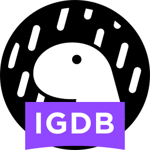

# IGDB API Deno

> This is an IGDB client for Deno



## Getting Started

To start working with the client you need to create an
account to work with. For more information about how to
create an account please visit [igdb.com](https://api-docs.igdb.com/#account-creation) and follow the instructions.

Once you have a `clientId` and `clientSecret` then you
are ready to start using the client, so for that.

```typescript
import { IgdbClient } from 'https://deno.land/x/igdb_api/mod.ts'

const client = new IgdbClient(<your-client-id>, <your-client-secret>)

await client.getAccessToken()
```

The example above is the minimun required to start working with the
IGDB client
